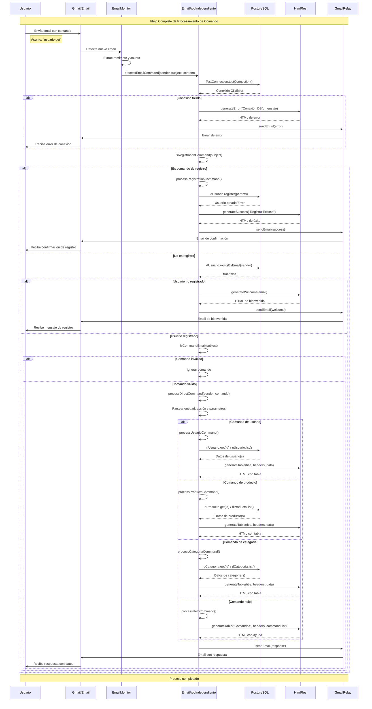
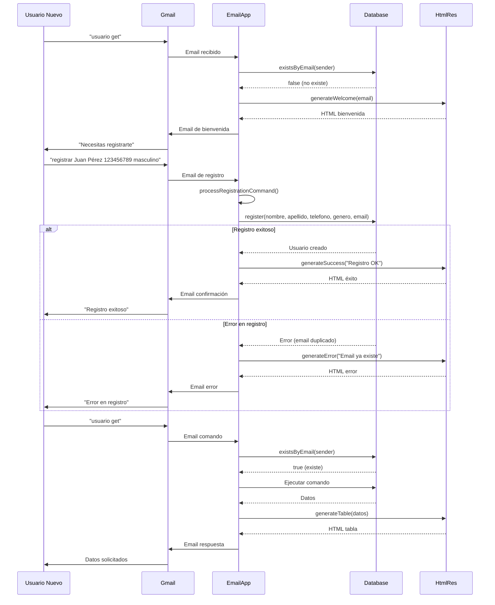
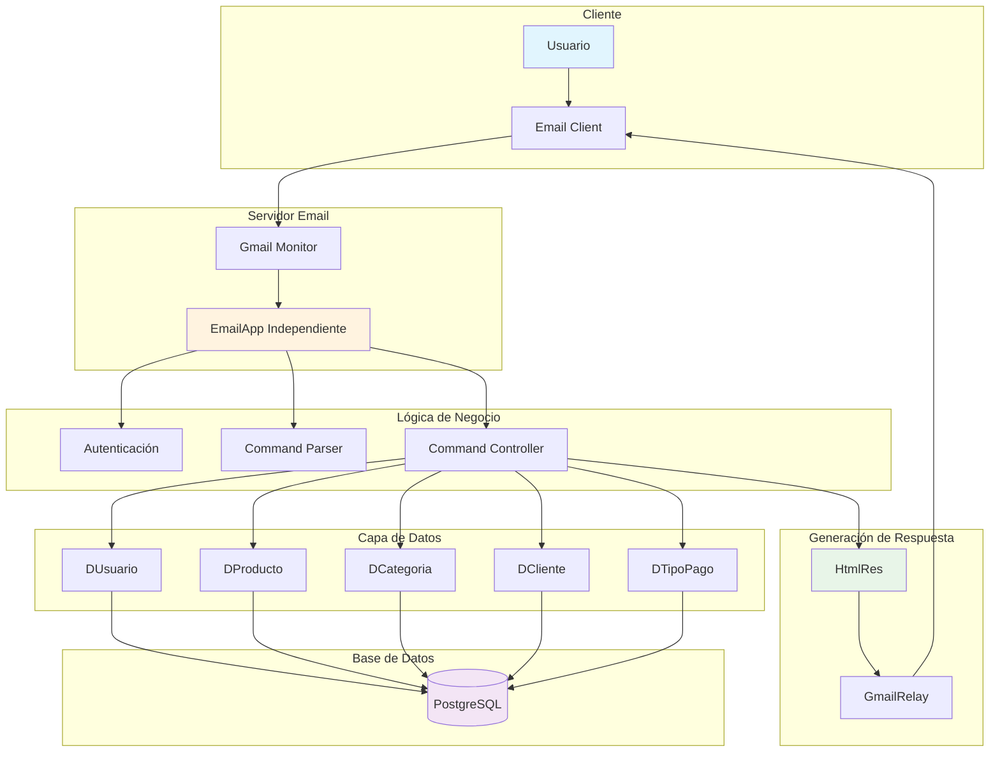
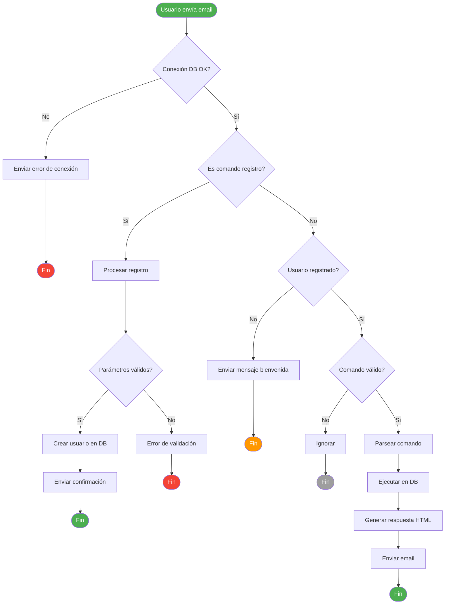
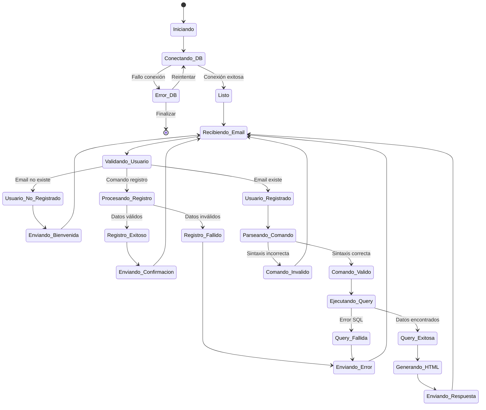

# 🔄 Diagrama de Secuencia - Sistema de Gestión por Email

## Flujo Principal del Sistema

## Flujo de Autenticación y Registro

## Arquitectura de Componentes

## Flujo de Datos

## Estados del Sistema

---

## 📋 Leyenda de Componentes

| Componente | Función |
|------------|---------|
| **Usuario** | Envía comandos por email |
| **Gmail Monitor** | Detecta nuevos emails |
| **EmailApp** | Procesa comandos y lógica |
| **Database** | Almacena datos (PostgreSQL) |
| **HtmlRes** | Genera respuestas HTML |
| **GmailRelay** | Envía emails de respuesta |

## 🎯 Puntos Clave del Flujo

1. **Autenticación obligatoria** para todos los comandos (excepto registro)
2. **Validación de conexión** antes de procesar
3. **Generación de HTML moderno** para todas las respuestas
4. **Manejo robusto de errores** en cada etapa
5. **Logging detallado** para monitoreo y debugging 