# 🔄 DIAGRAMA DE SECUENCIA - SISTEMA DE E-COMMERCE POR EMAIL

## 📋 **Resumen del Flujo**

Diagrama de secuencia completo que muestra la interacción entre el **Cliente**, **EmailAppIndependiente**, **Base de Datos** y **Sistema de Email** durante todo el proceso de compra.

---

## 🎯 **Diagrama Completo**

```mermaid
sequenceDiagram
    participant C as 👤 Cliente
    participant E as 📧 Email System  
    participant A as 🤖 EmailApp
    participant DB as 🗄️ Database
    participant S as 📦 Stock System

    note over C,S: 🛒 SISTEMA DE E-COMMERCE POR EMAIL - FLUJO COMPLETO

    %% === REGISTRO ===
    rect rgb(240, 248, 255)
        note over C,S: 📝 FASE 1: REGISTRO DE USUARIO
        C->>E: 📧 "registrar Juan Pérez 987654321 masculino"
        E->>A: 📨 Procesar comando registro
        A->>DB: 🔍 Verificar email no existe
        DB-->>A: ✅ Email disponible
        A->>DB: 💾 INSERT users + clientes
        DB-->>A: ✅ Usuario ID 51, Cliente ID 30
        A->>E: 📤 Reply: "✅ Registro exitoso"
        E->>C: 📧 "Bienvenido Juan! Cuenta creada"
    end

    %% === EXPLORACIÓN ===
    rect rgb(245, 255, 245)
        note over C,S: 🔍 FASE 2: EXPLORACIÓN DE PRODUCTOS  
        C->>E: 📧 "productos get"
        E->>A: 📨 Procesar consulta productos
        A->>DB: 🔍 SELECT productos
        DB-->>A: 📋 Lista 22 productos
        A->>E: 📤 Reply: Tabla HTML productos
        E->>C: 📧 "Lista de Productos [Tabla]"
    end

    %% === CARRITO ===
    rect rgb(255, 248, 240)
        note over C,S: 🛒 FASE 3: GESTIÓN DE CARRITO
        C->>E: 📧 "carrito add 142 2"
        E->>A: 📨 Procesar agregar carrito
        A->>DB: 🔍 Obtener cliente por email
        DB-->>A: ✅ Cliente ID 30
        A->>DB: 🔍 Verificar stock producto 142
        DB-->>A: ✅ Stock: 100 disponible
        A->>DB: 💾 Crear/obtener carrito activo
        DB-->>A: ✅ Carrito ID 3
        A->>DB: 💾 INSERT Detalle_carrito
        DB-->>A: ✅ Producto agregado
        A->>DB: 🔄 UPDATE total carrito
        A->>E: 📤 Reply: "✅ Producto agregado"
        E->>C: 📧 "Jugo de Naranja agregado x2"
        
        C->>E: 📧 "carrito get"  
        E->>A: 📨 Ver contenido carrito
        A->>DB: 🔍 SELECT carrito + productos
        DB-->>A: 📋 2x Jugo Naranja, Total: $10,000
        A->>E: 📤 Reply: Tabla carrito
        E->>C: 📧 "🛒 Tu Carrito - Total: $10,000"
    end

    %% === CHECKOUT ===
    rect rgb(248, 240, 255)
        note over C,S: 🏪 FASE 4: PROCESO DE CHECKOUT
        C->>E: 📧 "checkout"
        E->>A: 📨 Procesar checkout
        A->>DB: 🔍 Verificar carrito activo
        DB-->>A: ✅ Carrito ID 3 con productos
        A->>DB: 🔍 Verificar stock todos productos
        DB-->>A: ✅ Stock suficiente
        A->>DB: 💾 BEGIN TRANSACTION
        A->>DB: 💾 INSERT NotaVenta (pendiente)
        DB-->>A: ✅ Venta ID 2 creada
        A->>DB: 💾 INSERT Detalle_Venta
        A->>DB: 🔄 UPDATE carrito (procesado)
        A->>DB: ✅ COMMIT TRANSACTION
        A->>E: 📤 Reply: "✅ Checkout exitoso"
        E->>C: 📧 "Orden #2 creada. Usa 'pago 2 [tipo]'"
    end

    %% === MÉTODOS DE PAGO ===
    rect rgb(240, 255, 248)
        note over C,S: 💳 FASE 5: CONSULTA MÉTODOS DE PAGO
        C->>E: 📧 "tipos_pago get"
        E->>A: 📨 Consultar métodos pago
        A->>DB: 🔍 SELECT tipos_pago
        DB-->>A: 📋 5 métodos disponibles
        A->>E: 📤 Reply: Tabla métodos
        E->>C: 📧 "Lista de Tipos de Pago [Tabla]"
    end

    %% === PAGO ===  
    rect rgb(255, 240, 248)
        note over C,S: 💰 FASE 6: COMPLETAR PAGO
        C->>E: 📧 "pago 2 1"
        E->>A: 📨 Procesar pago
        A->>DB: 🔍 Verificar venta pendiente
        DB-->>A: ✅ Venta ID 2 pendiente
        A->>DB: 💾 BEGIN TRANSACTION
        A->>DB: 💾 INSERT pago
        DB-->>A: ✅ Pago ID 1 creado
        A->>S: 📦 Actualizar stock productos
        A->>DB: 🔄 UPDATE ProductoAlmacen stock
        DB-->>A: ✅ Stock actualizado 2 productos  
        A->>DB: 🔄 UPDATE NotaVenta (completada)
        A->>DB: ✅ COMMIT TRANSACTION
        A->>E: 📤 Reply: "✅ Pago completado"
        E->>C: 📧 "¡Compra exitosa! Stock actualizado"
    end

    %% === HISTORIAL ===
    rect rgb(248, 255, 240)
        note over C,S: 📋 FASE 7: CONSULTA HISTORIAL
        C->>E: 📧 "ventas get"
        E->>A: 📨 Consultar historial
        A->>DB: 🔍 SELECT ventas + pagos cliente
        DB-->>A: 📋 Historial completo
        A->>E: 📤 Reply: Tabla historial  
        E->>C: 📧 "📋 Tu Historial de Compras"
        
        C->>E: 📧 "ventas get 2"
        E->>A: 📨 Detalle venta específica
        A->>DB: 🔍 SELECT detalle venta 2
        DB-->>A: 📋 Detalle productos
        A->>E: 📤 Reply: Tabla detalle
        E->>C: 📧 "📋 Detalle de Venta #2"
    end

    note over C,S: ✅ COMPRA COMPLETA - CLIENTE SATISFECHO
```

---

## 🎉 **RESUMEN FINAL**

### **✅ Sistema 100% Funcional**
- 🛒 **Carrito de compras** - Agregar, ver, remover productos
- 🏪 **Proceso de checkout** - Crear órdenes automáticamente  
- 💰 **Sistema de pagos** - Completar con métodos variados
- 📋 **Historial completo** - Ver compras pasadas y detalles
- 📦 **Control de stock** - Actualización automática
- 💬 **Threading automático** - Conversación fluida por email

### **🚀 Innovación Disruptiva**
**Primera implementación mundial** de un sistema de e-commerce 100% funcional que opera exclusivamente por email.

---

_Diagrama de Secuencia del Sistema de E-commerce por Email v1.0_  
_Desarrollado por: Marco David Toledo_  
_Fecha: Diciembre 2024_ 