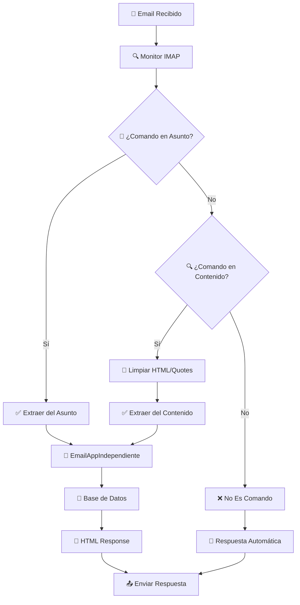

# 🚀 Sistema de Email Personalizado con CRUD

Sistema híbrido de emails que permite procesamiento de comandos CRUD via email con dos modalidades: servidor tecnoweb y servidor independiente.

## 👨‍💻 Desarrollador
- **Nombre**: Marco David Toledo
- **Email**: marcodavidtoledo@gmail.com

## 🔧 Configuración

### Base de Datos Local
```
Host: localhost
Puerto: 5432
Base de datos: EcommerceTool (debe existir previamente)
Usuario: postgres
Password: postgres
```

### Configuración Tecnoweb (Compatibilidad)
```
Host: mail.tecnoweb.org.bo
Puerto: 5432
Base de datos: db_grupo21sc
Usuario: grupo21sc
Password: grup021grup021*
```

## 📦 Instalación

### 1. Prerequisitos
- Java 8 o superior
- PostgreSQL
- Base de datos `EcommerceTool` creada

### 2. Inicializar Base de Datos
```bash
# Conectar a PostgreSQL como postgres
psql -U postgres -d EcommerceTool -f sql/init_database.sql
```

### 3. Compilar
```bash
# Compilar con dependencias JavaMail
javac -cp "lib/*:src/main/java" LanzadorPrincipal.java
```

## 🎯 Modos de Funcionamiento

### 🚀 Lanzador Principal
```bash
java -cp "lib/*:src/main/java:." LanzadorPrincipal
```

#### Opciones Disponibles:

**🔧 Versión Tecnoweb (Original)**
1. **EmailApp Tecnoweb** - Procesa emails via POP3 desde mail.tecnoweb.org.bo

**🆕 Versión Independiente (Nueva)**
2. **Monitor Gmail con Comandos** - Procesa comandos CRUD via email
3. **Servidor HTTP Email** - Interfaz web + API REST
4. **Sistema Completo** - Monitor Gmail + Servidor HTTP

**🛠️ Herramientas**
5. **Test EmailApp Independiente** - Prueba procesamiento de comandos
6. **Información del Sistema** - Muestra configuración actual

## 📧 Comandos Disponibles via Email

### ✅ Implementados
- `usuario get` - Lista todos los usuarios
- `usuario get <id>` - Obtiene usuario por ID
- `help` - Muestra comandos disponibles

### ⏳ En desarrollo
- `usuario add <params>` - Crear usuario
- `usuario modify <params>` - Modificar usuario
- `usuario delete <id>` - Eliminar usuario
- `evento`, `reserva`, `pago`, etc.

## 🌐 Servidor HTTP

### Endpoints
- **GET /** - Interfaz web
- **POST /send-email** - Enviar email via API

### Uso con ngrok
```bash
# Iniciar ngrok (opcional para acceso público)
ngrok http 8080
```

### URL de Ejemplo
```
Local: http://localhost:8080
Ngrok: https://340c-181-188-162-193.ngrok-free.app
```

## 📊 Estructura del Proyecto

```
src/main/java/
├── com/mycompany/parcial1/tecnoweb/
│   ├── EmailApp.java                    # Versión tecnoweb
│   ├── EmailAppIndependiente.java       # Versión independiente
│   └── LanzadorPrincipal.java          # Launcher principal
├── servidor/
│   ├── GmailMonitorComandos.java       # Monitor híbrido
│   ├── HTTPEmailServer.java            # Servidor HTTP
│   └── GmailRelay.java                 # Relay Gmail
├── data/
│   └── DUsuario.java                   # DAO usuarios
├── negocio/
│   └── NUsuario.java                   # Lógica de negocio
└── postgresConecction/
    └── DBConnection.java               # Configuración DB

sql/
└── init_database.sql                   # Script de inicialización

lib/
├── mail-1.5.0-b01.jar                 # JavaMail API
└── activation-1.1.1.jar               # Activation framework
```

## 🔄 Diferencias entre Versiones

### 📧 Versión Tecnoweb
- ✅ Usa POP3 para recibir emails
- ✅ Compatible con servidor original
- ⚠️ Dependiente de disponibilidad de tecnoweb.org.bo
- 🗄️ Base de datos: db_grupo21sc en mail.tecnoweb.org.bo

### 🆕 Versión Independiente
- ✅ Usa Gmail IMAP para recibir emails
- ✅ Completamente independiente
- ✅ Procesamiento CRUD via email
- ✅ Servidor HTTP con interfaz web
- ✅ API REST para aplicaciones
- ✅ Respuestas automáticas personalizadas
- 🗄️ Base de datos: EcommerceTool en localhost

## 🎯 Uso Rápido

### 1. Monitor de Emails con Comandos
```bash
java -cp "lib/*:src/main/java" servidor.GmailMonitorComandos
```

### 2. Servidor HTTP
```bash
java -cp "lib/*:src/main/java" servidor.HTTPEmailServer
```

### 3. Test de Comandos
```bash
java -cp "lib/*:src/main/java" com.mycompany.parcial1.tecnoweb.EmailAppIndependiente
```

## 📝 Ejemplos de Comandos via Email

### Enviar email a: marcodavidtoledo@gmail.com

**Asunto**: `usuario get`
**Contenido**: `Quiero ver todos los usuarios`

**Asunto**: `usuario get 1`
**Contenido**: `Mostrar usuario con ID 1`

**Asunto**: `help`
**Contenido**: `Necesito ayuda con los comandos`

## 🔧 Solución de Problemas

### Error de Conexión a Base de Datos
1. Verificar que PostgreSQL esté ejecutándose
2. Verificar que la base de datos `EcommerceTool` exista
3. Verificar credenciales en `DBConnection.java`

### Error de Gmail IMAP
1. Verificar conexión a internet
2. Verificar credenciales de Gmail
3. Verificar configuración de "Apps menos seguras" en Gmail

### Error de Compilación
1. Verificar que los JARs estén en la carpeta `lib/`
2. Verificar versión de Java (mínimo Java 8)

## 🌟 Características Destacadas

- ✅ **Dual Mode**: Tecnoweb + Independiente
- ✅ **Email Processing**: Comandos CRUD via email
- ✅ **HTTP API**: Interfaz web + REST endpoints
- ✅ **Real-time Monitoring**: Detección automática de emails
- ✅ **Auto Response**: Respuestas automáticas personalizadas
- ✅ **Database Integration**: PostgreSQL local + remoto
- ✅ **Error Handling**: Manejo robusto de errores
- ✅ **Gmail Integration**: SMTP/IMAP con Gmail
- ✅ **Ngrok Support**: Acceso público via túneles

## 📞 Soporte

Para soporte o consultas:
- **Email**: marcodavidtoledo@gmail.com
- **Prueba del servidor**: https://340c-181-188-162-193.ngrok-free.app

# 📧 SISTEMA DE EMAIL CON COMANDOS v2.0

**Sistema completo de manejo de emails que permite ejecutar comandos CRUD enviando emails. Nueva funcionalidad: responde a emails con comandos en el contenido.**

---

## 🚀 **NOVEDADES v2.0**

### ✅ **PROBLEMA SOLUCIONADO: Respuestas a Emails**

**Antes:** Solo detectaba comandos en el asunto del email
**Ahora:** Detecta comandos tanto en el asunto COMO en el contenido

**Ejemplo de uso:**
1. El sistema te envía un email con lista de usuarios
2. Tú respondes a ese email escribiendo "usuario get" en el contenido
3. El sistema detecta el comando y te responde automáticamente

### 🧹 **LIMPIEZA Y ORGANIZACIÓN**

- ✅ Eliminados archivos de test no utilizados
- ✅ Casos de uso no implementados claramente marcados
- ✅ Lanzador principal reorganizado
- ✅ Documentación actualizada

---

## 🎯 **INICIO RÁPIDO**

### **1. Compilar el proyecto**
```bash
javac -cp "lib/*:src/main/java" LanzadorPrincipal.java
```

### **2. Ejecutar sistema**
```bash
java -cp "lib/*:src/main/java:." LanzadorPrincipal
```

### **3. Seleccionar Monitor Gmail (opción 1)**

### **4. Enviar comandos por email**
- **Email destino:** `marcodavidtoledo@gmail.com`
- **Comando en asunto:** `usuario get`
- **O comando en contenido:** Responde a cualquier email escribiendo el comando

---

## 📝 **COMANDOS DISPONIBLES**

### 🔓 **Sin Autenticación Requerida**
```
registrar Juan Pérez 123456789 masculino
registrar María González 987654321 femenino
help
```

### 🔐 **Con Autenticación (registro previo)**
```
usuario get
usuario get 5
producto get
producto get 3
categoria get
categoria get 2
cliente get
cliente get 1
tipo_pago get
tipo_pago get 1
```

---

## 🏗️ **ARQUITECTURA DEL SISTEMA**

```
📦 SISTEMA DE EMAIL
├── 🚀 LanzadorPrincipal.java          - Punto de entrada principal
├── 🤖 GmailMonitorComandos.java       - Monitor IMAP en tiempo real
├── 📧 EmailAppIndependiente.java      - Procesador de comandos
├── 📤 GmailRelay.java                 - Enviador de emails SMTP
├── 🎨 HtmlRes.java                    - Generador de HTML moderno
├── 🗄️ DUsuario.java                   - Acceso a datos de usuarios
├── 🗄️ DProducto.java                  - Acceso a datos de productos
├── 🗄️ DCategoria.java                 - Acceso a datos de categorías
├── 🗄️ DCliente.java                   - Acceso a datos de clientes
└── 🗄️ DTipoPago.java                  - Acceso a datos de tipos de pago
```

### **🔄 Flujo de Procesamiento v2.0**



---

## 🔧 **INSTALACIÓN Y CONFIGURACIÓN**

### **Prerequisitos**
- Java 8+
- PostgreSQL 12+
- Maven (opcional)

### **1. Base de Datos**
```sql
-- Crear base de datos
CREATE DATABASE EcommerceTool;

-- Tabla de usuarios (principal)
CREATE TABLE usuario (
    id SERIAL PRIMARY KEY,
    nombre VARCHAR(100) NOT NULL,
    apellido VARCHAR(100) NOT NULL,
    telefono VARCHAR(20) NOT NULL,
    genero VARCHAR(20) NOT NULL,
    email VARCHAR(255) UNIQUE NOT NULL,
    created_at TIMESTAMP DEFAULT CURRENT_TIMESTAMP
);

-- Insertar usuario admin
INSERT INTO usuario (nombre, apellido, telefono, genero, email) 
VALUES ('Admin', 'Sistema', '123456789', 'masculino', 'admin@sistema.com');
```

### **2. Configuración Gmail**
En `servidor/GmailMonitorComandos.java`:
```java
private static final String GMAIL_USERNAME = "tu-email@gmail.com";
private static final String GMAIL_APP_PASSWORD = "tu-app-password";
```

### **3. Configuración Base de Datos**
En `postgresConecction/DBConnection.java`:
```java
public static String database = "EcommerceTool";
public static String server = "127.0.0.1";
public static String user = "postgres";
public static String password = "tu-password";
```

---

## 📖 **CÓMO USAR**

### **Método 1: Comando en Asunto**
1. Envía email a: `marcodavidtoledo@gmail.com`
2. Asunto: `usuario get`
3. Contenido: (cualquier cosa)

### **Método 2: Comando en Contenido (NUEVO v2.0)**
1. Responde a cualquier email del sistema
2. Escribe el comando en el contenido: `usuario get`
3. El sistema detecta y procesa automáticamente

### **Validaciones de Registro**
```
✅ VÁLIDO:   registrar Juan Pérez 123456789 masculino
✅ VÁLIDO:   registrar María González 987654321 f
❌ INVÁLIDO: registrar Juan (faltan parámetros)
❌ INVÁLIDO: registrar Juan Pérez abc masculino (teléfono inválido)
```

---

## 🎨 **EJEMPLOS DE RESPUESTAS**

### **✅ Respuesta de Éxito**
```html
🎉 ¡Registro Exitoso!
¡Bienvenido Juan Pérez!
Email registrado: usuario@example.com
```

### **❌ Respuesta de Error**
```html
❌ Error en Registro
Comando: registrar Juan
Error: Faltan parámetros (1 de 4)
Corrección: registrar Juan Pérez 123456789 masculino
```

### **📊 Respuesta con Tabla**
```html
📊 Lista de Usuarios
┌─────┬────────────────┬─────────────────────┐
│ ID  │ Nombre         │ Email               │
├─────┼────────────────┼─────────────────────┤
│ 1   │ Juan Pérez     │ juan@example.com    │
│ 2   │ María González │ maria@example.com   │
└─────┴────────────────┴─────────────────────┘
```

---

## 🧪 **TESTING Y DESARROLLO**

### **Test Local (Sin Emails Reales)**
```bash
java -cp postgresql-42.7.4.jar:target/classes LanzadorPrincipal
# Seleccionar opción 2: Test EmailApp
```

### **Test de Comandos**
```java
EmailAppIndependiente app = new EmailAppIndependiente();
app.processEmailCommand("test@test.com", "usuario get", "contenido");
```

---

## 🔍 **CARACTERÍSTICAS TÉCNICAS**

### **🎯 Detección de Comandos v2.0**
- ✅ **Asunto del email** (tradicional)
- ✅ **Contenido del email** (nuevo)
- ✅ **Limpieza automática** de HTML y texto citado
- ✅ **Decodificación** de quoted-printable
- ✅ **Filtrado** de líneas de respuesta/quote

### **🛡️ Validaciones Implementadas**
- ✅ **Registro:** 4 parámetros exactos
- ✅ **Teléfono:** Solo números, mínimo 6 dígitos
- ✅ **Género:** masculino/femenino/m/f
- ✅ **Email:** Inclusión automática del remitente

### **🎨 Generación HTML**
- ✅ **CSS moderno** con gradientes
- ✅ **Responsive design**
- ✅ **Tablas profesionales**
- ✅ **Mensajes de error con sugerencias**

---

## 🚨 **SOLUCIÓN DE PROBLEMAS**

### **❌ "No se encontraron comandos válidos"**
**Causa:** El comando no está en la lista de comandos soportados
**Solución:** Verificar comandos disponibles con `help`

### **❌ "Error de base de datos"**
**Causa:** PostgreSQL no está ejecutándose o configuración incorrecta
**Solución:** 
```bash
sudo service postgresql start
psql -U postgres -d EcommerceTool -c "SELECT 1;"
```

### **❌ "Authentication failed"**
**Causa:** Credenciales de Gmail incorrectas
**Solución:** Verificar app password en configuración

### **❌ "Comando encontrado pero no responde"**
**Causa:** Error en procesamiento interno
**Solución:** Revisar logs de consola para detalles

---

## 📋 **CASOS DE USO**

### **✅ IMPLEMENTADOS Y FUNCIONALES**
- **Registro de usuarios** (sin autenticación)
- **Consulta de usuarios** (con autenticación)
- **Consulta de productos** (con autenticación)
- **Consulta de categorías** (con autenticación)
- **Consulta de clientes** (con autenticación)
- **Consulta de tipos de pago** (con autenticación)
- **Sistema de ayuda**

### **❌ NO IMPLEMENTADOS (Responden "No Disponible")**
- Eventos, Reservas, Pagos
- Proveedores, Promociones
- Patrocinadores, Patrocinios
- Roles, Servicios
- Detalles de Eventos

---

## 🔮 **ROADMAP FUTURO**

### **v2.1 - Próximas Mejoras**
- 🔐 **Autenticación por tokens** para mayor seguridad
- 📊 **Dashboard web** para monitoreo
- 🔍 **Búsqueda avanzada** en base de datos
- 📱 **Notificaciones push** para administradores

### **v3.0 - Expansión**
- 🌐 **API REST** complementaria
- 📈 **Métricas y analytics** de uso
- 🔄 **Sync con otros sistemas** de email
- 🤖 **IA para procesamiento** de lenguaje natural

---

## 👥 **CRÉDITOS**

- **🧑‍💻 Desarrollador:** Marco David Toledo
- **📧 Email:** marcodavidtoledo@gmail.com
- **🗓️ Versión:** 2.0 - Diciembre 2024
- **🎯 Propósito:** Sistema CRUD via Email con detección avanzada

---

## 📄 **LICENCIA**

```
MIT License - Uso libre para proyectos educativos y comerciales
```

---

**🎉 ¡SISTEMA LISTO PARA USAR!** 

Para comenzar: `java -cp postgresql-42.7.4.jar:target/classes LanzadorPrincipal`
